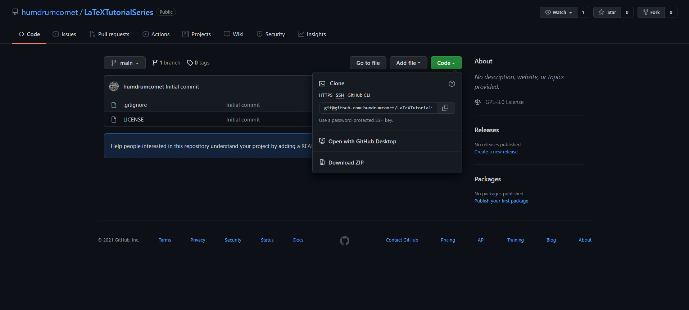
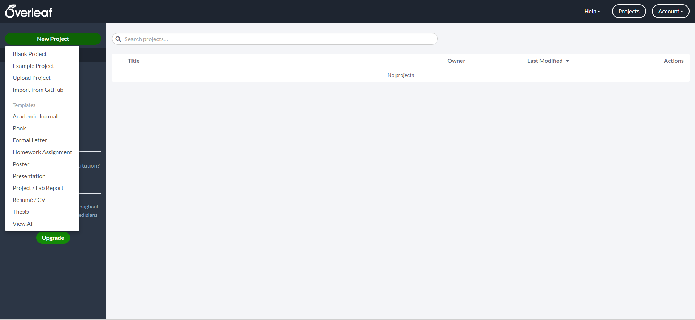
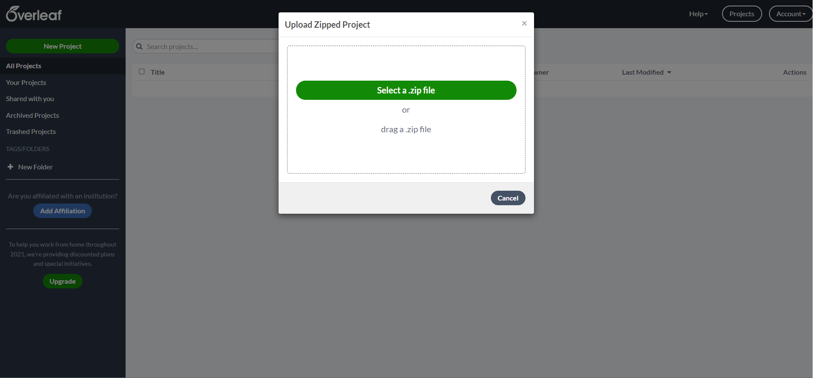

# LaTeX Introduction

Welcome to the LaTeX introduction workshop.
This is the first in a series of workshops aimed at getting people comfortable with the typesetting tool LaTeX, and ensuring that they're able to create great documents effectively and efficiently.
To grab blank versions of the LaTeX code (with the preamble and example definitions, but without the text) you can go [here](https://github.com/humdrumcomet/LaTeXCodingSession).\

To return to the top level directory of the tutorials, click [here](https://github.com/humdrumcomet/LaTeXTutorialSeries).\
To go to the next workshop in the series, click [here](https://github.com/humdrumcomet/LaTeXAdvancedWorkshop).\

## Overview
This tutorial document is designed to be used in Overleaf, but will work with any current version of TeXlive. 
If you are compiling this document outside of Overleaf, please note that the minted package has an external dependency of [Pygments](https://pygments.org/), but Pygments is multiplatform and will work with Windows, Mac, or Linux.

## Usage
To use this repository with Overleaf, follow the instructions below:

1. Select the `Code` green button and then select `Download ZIP` as shown below.

2. Navigate to Overleaf and once logged in, select the `New Project` green button at the top left corner of the screen.

3. Select the `Upload Project` option from the menu.

4. Click the `Select a .zip file` button and upload the downloaded zip file.

5. The LaTeX project is started and you are ready to go!

## Authors

* Aaron English
* Ghassan Arnouk

## License

This project is licensed under the [GNU General Public License](LICENSE)

[LICENSE]: https://github.com/humdrumcomet/LaTeXTutorialSeries/blob/main/LICENSE
